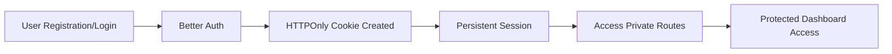

# 🚗 DriveFleet — Premium Car Rental Platform

<div align="center">


### ✨ Explore • Book • Manage Premium Cars Effortlessly

<p>
  <a href="https://drivefleet-client-sigma.vercel.app">
    
  </a>
  <a href="https://nextjs.org/">
    
  </a>
  <a href="https://tailwindcss.com/">
    
  </a>
  <a href="https://vercel.com/">
    
  </a>
</p>

<p>
  
  
  
  
</p>

</div>

---

# 🌟 Overview

**DriveFleet** is a modern full-stack car rental platform designed to deliver a seamless experience for both car owners and renters.

Users can:

* 🚙 Discover premium vehicles
* 📅 Book cars instantly
* 🔍 Search & filter listings dynamically
* 📊 Manage bookings and listed vehicles
* 🔐 Enjoy secure authentication with persistent sessions

Built with scalability, responsiveness, and clean UI/UX in mind, DriveFleet combines modern frontend technologies with secure authentication and real-time database-driven functionality.

---

# 🔥 Key Features

## 🔐 Secure Authentication System

* Email/password authentication
* Google OAuth integration
* Powered by **Better Auth**
* HTTPOnly cross-domain cookies
* Persistent login sessions across refreshes
* Secure private route protection using `router.replace()`

---

## 🚘 Dynamic Car Listing Management

Logged-in users can:

* Add their own cars
* Upload car images
* Edit listings anytime
* Delete existing listings
* Manage all listings from a dedicated dashboard

Each listing includes:

* Car name & model
* Daily rental price
* Category/type
* Pickup location
* Seat capacity
* Availability status
* Images

---

## 📅 Smart Booking System

DriveFleet includes a complete booking workflow:

* Book available vehicles instantly
* Add special booking notes
* Optional driver assignment
* Booking status tracking
* Cancel bookings anytime
* Re-book cancelled vehicles in one click
* Automatic popularity tracking for cars

---

## 🔎 Advanced Search, Filter & Sorting

Database-powered search experience using MongoDB:

| Feature            | Implementation         |
| ------------------ | ---------------------- |
| Search by name     | MongoDB `$regex`       |
| Filter by category | MongoDB `$in`          |
| Sort by price      | Ascending / Descending |
| Sort by popularity | Most booked first      |
| Sort by latest     | Newest listings first  |

---

## 📊 Personalized User Dashboard

Users can manage all bookings through an intuitive dashboard:

* View all bookings
* Filter by booking status
* Cancel active bookings
* Re-book cancelled cars
* Responsive table & card layouts

---

# 🖥️ Tech Stack

<div align="center">

| Category           | Technology              |
| ------------------ | ----------------------- |
| Framework          | Next.js 16 (App Router) |
| Styling            | Tailwind CSS v4         |
| Authentication     | Better Auth             |
| Database           | MongoDB                 |
| Backend            | Express.js              |
| HTTP Client        | Axios                   |
| UI Components      | HeroUI                  |
| Notifications      | react-hot-toast         |
| Animation          | Framer Motion           |
| Icons              | lucide-react            |
| Image Optimization | next/image              |
| Deployment         | Vercel + Render         |

</div>

---

# 📁 Project Architecture

```bash
src/
├── app/
│   ├── page.js
│   ├── layout.js
│   ├── not-found.js
│   ├── login/page.jsx
│   ├── register/page.jsx
│   ├── add-car/page.jsx
│   ├── explore-cars/page.jsx
│   ├── cars/[id]/page.jsx
│   ├── my-added-cars/page.jsx
│   └── my-bookings/page.jsx
│
├── components/
│   ├── layout/
│   │   ├── Navbar.jsx
│   │   └── Footer.jsx
│   │
│   ├── home/
│   │   ├── HeroBanner.jsx
│   │   ├── AvailableCars.jsx
│   │   ├── WhyChooseUs.jsx
│   │   ├── CustomerReviews.jsx
│   │   └── CTASection.jsx
│   │
│   ├── PrivateRoute.jsx
│   └── LoadingSpinner.jsx
│
├── context/
│   └── AuthContext.jsx
│
└── lib/
    └── authClient.js
```

---

# 📄 Application Pages

| Page          | Route            | Access  |
| ------------- | ---------------- | ------- |
| Home          | `/`              | Public  |
| Explore Cars  | `/explore-cars`  | Public  |
| Car Details   | `/cars/[id]`     | Private |
| Add Car       | `/add-car`       | Private |
| My Added Cars | `/my-added-cars` | Private |
| My Bookings   | `/my-bookings`   | Private |
| Login         | `/login`         | Public  |
| Register      | `/register`      | Public  |
| 404 Page      | `/*`             | Public  |

---

# 🔒 Authentication Workflow



---

# 🚀 Getting Started

## 📦 Prerequisites

Make sure you have installed:

* Node.js 18+
* npm / yarn / pnpm
* MongoDB server
* DriveFleet backend server

---

## ⚙️ Installation

```bash
git clone https://github.com/nilanjanajui/drivefleet-client.git

cd drivefleet-client

npm install
```

---

## 🔑 Environment Variables

Create a `.env.local` file in the root directory:

```env
NEXT_PUBLIC_API_URL=http://localhost:5000
NEXT_PUBLIC_BETTER_AUTH_URL=http://localhost:5000
```

---

## ▶️ Run Development Server

```bash
npm run dev
```

Open:

```bash
http://localhost:3000
```

---

# 🌐 Live Deployment

<div align="center">

### 🚀 Live Website

## [https://drivefleet-client-sigma.vercel.app](https://drivefleet-client-sigma.vercel.app)

</div>

---

# 🔗 Related Repository

### 🛠️ Backend Server

* Express.js + MongoDB API
* Booking management
* Authentication handling
* Database operations

👉 [https://github.com/nilanjanajui/drivefleet-server](https://github.com/nilanjanajui/drivefleet-server)

---

# 🎯 Highlights

✅ Fully Responsive Design
✅ Protected Private Routes
✅ Persistent Authentication
✅ Dynamic Database Queries
✅ Booking Management System
✅ Modern UI/UX
✅ Production Deployment
✅ Scalable Component Structure

---

# 📸 Suggested Future Improvements

* 💳 Stripe Payment Integration
* 🗺️ Google Maps Location Support
* ⭐ User Reviews & Ratings
* 📱 Progressive Web App (PWA)
* 🔔 Real-time Notifications
* 📈 Analytics Dashboard
* ❤️ Wishlist / Favorites
* 🧠 AI-based Car Recommendations

---

# 🤝 Contributing

Contributions, issues, and feature requests are welcome.

Feel free to fork the repository and submit pull requests.

---

# 📜 License

This project is licensed under the MIT License.

---

<div align="center">

## 🚗 DriveFleet

### Experience Premium Car Rentals With Modern Web Technology

⭐ If you like this project, consider giving it a star on GitHub.

</div>
